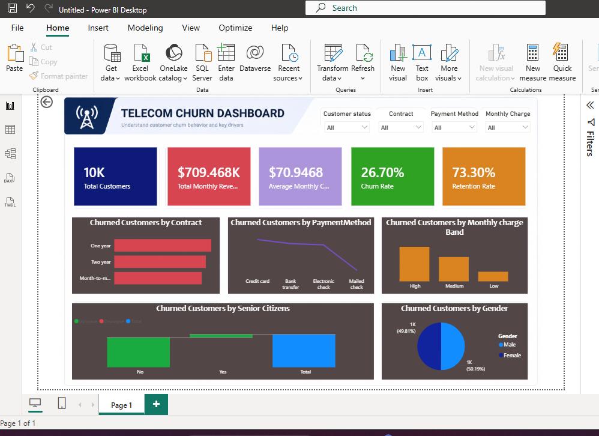

# Telecom-Churn-analysis
Interactive Power BI dashboard analyzing telecom customer churn using DAX, KPIs, and data visualization to uncover customer retention insights.
This project presents an end-to-end customer churn analysis for a telecommunications company using Microsoft Excel and Power BI. The dataset was first cleaned and prepared in Excel before being imported into Power BI for data modeling, DAX calculations, and dashboard development.

The interactive dashboard provides key insights into customer behavior by tracking important business metrics such as Total Customers, Total Monthly Revenue, Average Monthly Charges, Churn Rate, and Retention Rate. It also enables users to explore customer churn across different dimensions, including Contract Type, Payment Method, Monthly Charge Band, Gender, and Senior Citizen Status through interactive slicers and visualizations.

The objective of this project is to help decision-makers identify factors contributing to customer churn and support data-driven strategies for improving customer retention and revenue performance.

## Dashboard Preview

Tools Used
Microsoft Excel
Microsoft Power BI
DAX (Data Analysis Expressions)
Skills Demonstrated
Data Cleaning
Data Transformation
Data Modeling
DAX Measures
KPI Development
Dashboard Design
Data Visualization
Business Intelligence
Data Storytelling
Key Metrics
Total Customers
Total Monthly Revenue
Average Monthly Charges
Churn Rate
Retention Rate
Dashboard Features
Interactive slicers
KPI cards
Customer churn analysis by contract type
Payment method analysis
Monthly charge band analysis
Gender and senior citizen segmentation
Business insights and recommendations
